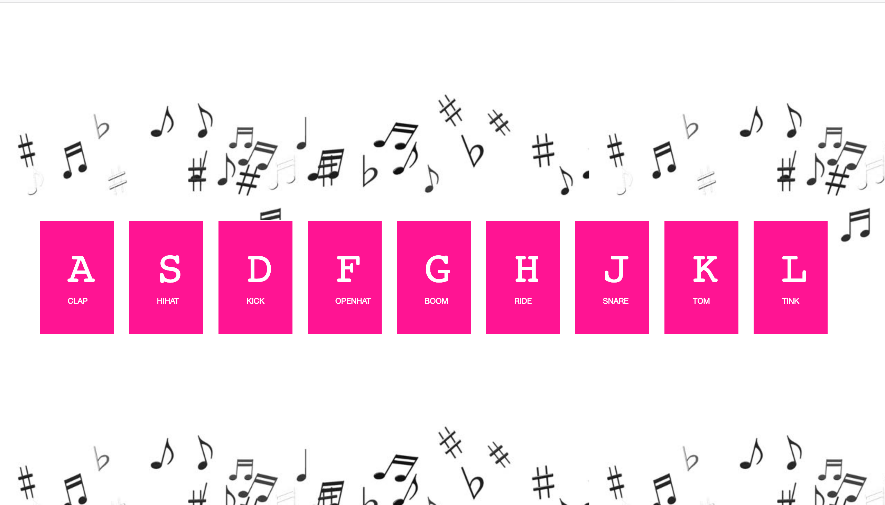
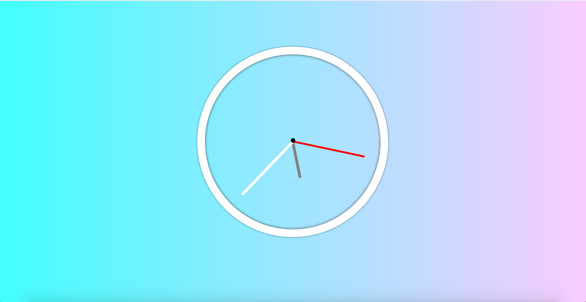
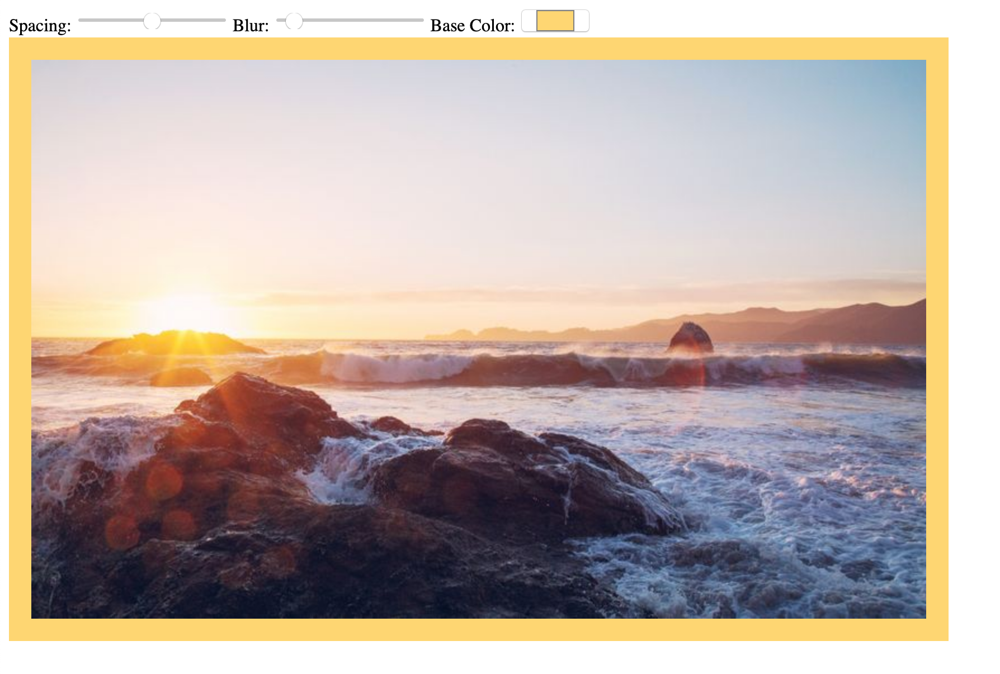

# JavaScript-30

## JavaScript-1 : JavaScript Drumkit

### [Demo](https://javascript-drumkit.glitch.me/)

## JavaScript-2 : Clock

### [Demo](https://clock-js.glitch.me/)

## JavaScript-3 : Variables in CSS

### [Demo](https://codepen.io/namrathasubramanya/full/XQKZwp)

## JavaScript-4 : Array Cardio

## JavaScript-5: Flex Panel Image Gallery

### [Demo]

